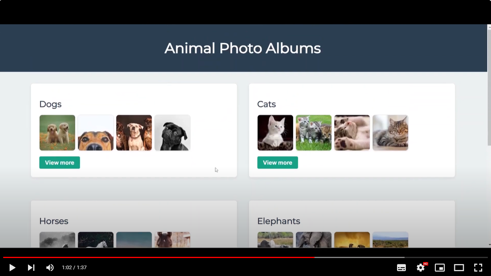
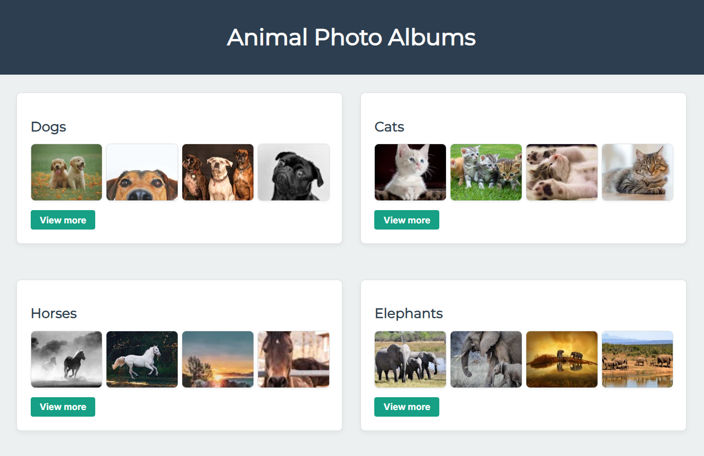
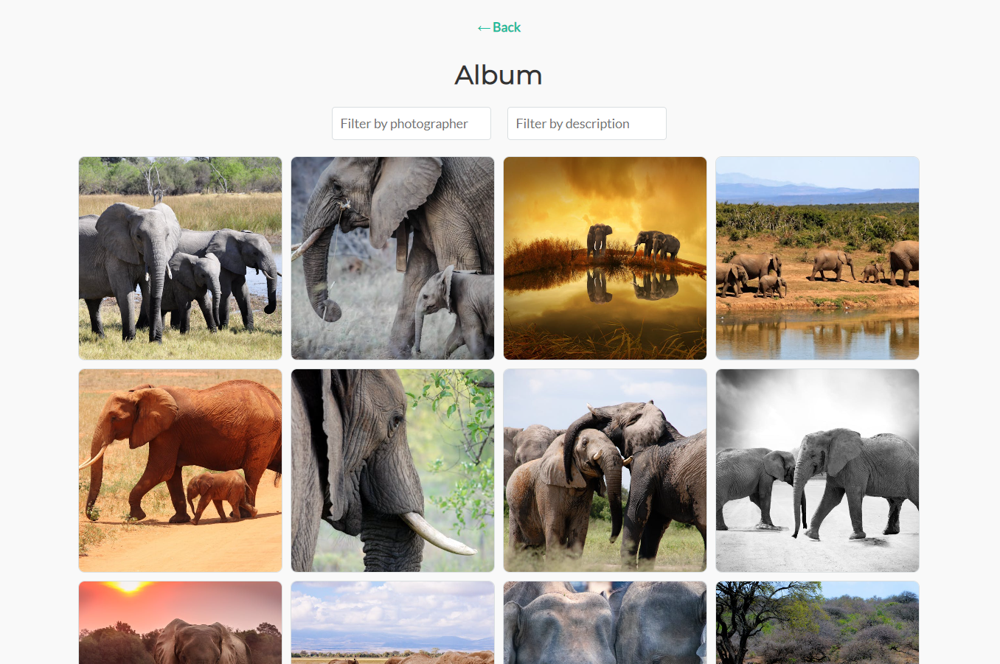

# 🎯 Galería de Fotos

## 📌 Objetivo

Desarrollar una aplicación web interactiva utilizando Next.js y TypeScript que permita a las usuarias explorar diferentes álbumes de fotos, ver detalles de cada foto y aplicar filtros para buscar fotos por descripción o fotógrafo.

## 🛠️ Tecnologías a repasar

- [Next.js](https://nextjs.org/). Framework de React.
- [App Router](https://nextjs.org/docs/app). Instalado por defecto al crear un proyecto de Next, proporciona una nueva forma de organizar las rutas y manejar la navegación de las aplicaciones.
- [TypeScript](https://www.typescriptlang.org/). Extensión de JS, permite añadir tipos estáticos. Su principal ventaja es que permite detectar errores en tiempo de desarrollo y facilita la lectura y mantenimiento del código al definir con precisión los tipos de datos que se esperan en las funciones, variables y componentes.
- Estilos. Puedes elegir el sistema de estilos que prefieras, pero recomendamos utilizar módulos de [SASS](https://sass-lang.com/), preprocesador de CSS que permite el uso de variables, mixins y funciones para escribir estilos organizados y mantenibles.

## 📝 Requisitos del Proyecto

En este proyecto nos centramos exclusivamente en el **frontend**.

### Vistas

#### Página principal

- Mostrar una lista de álbumes de fotos con una vista previa de algunas fotos.
- Cada álbum será un enlace que llevará a una página de detalles del álbum.

Aquí tienes un ejemplo de cómo podría quedar esta vista, pero te animamos a usar tu imaginación y creatividad para la maquetación de la página. Puedes personalizar el estilo y la disposición de los elementos según lo que mejor se ajuste a tu visión del proyecto. En este ejemplo se ha optado por hacer temáticas de animales, pero puedes elegir cualquier otra temática que te inspire, como paisajes, ciudades, comida, deportes o cualquier otra idea que se te ocurra. Te recomendamos investigar el API de Pexels para inspirarte.

#### Página Detalle del álbum

- Listar todas las fotos del álbum seleccionado.
- Ofrecer la opción de aplicar filtros por descripción de la foto o por el nombre del fotógrafo.

### API: Pexels

- Utilizar el [API de Pexels](https://www.pexels.com/api/documentation/) para obtener las fotografías. Es necesario registrarse en la plataforma para obtener el API Key. También te recomendamos crear variables de entorno y un fichero `.env` para guardar el API Key de forma segura.
- Implementar la funcionalidad de búsqueda por temas (nature, ocean, tigers, etc.) usando el endpoint: [Pexels Photos Search API](https://www.pexels.com/api/documentation/#photos-search).
  Por ejemplo, este es el endpoint para obtener 12 fotografías de elefantes: `https://api.pexels.com/v1/search?query=elephant&per_page=12`

### Tipado

Para mejorar la robustez del código, vamos a utilizar **TypeScript**. Esto significa que todos los componentes, funciones y objetos deben estar debidamente tipados. Por ejemplo, deberás definir interfaces para las fotos, los álbumes y cualquier otro tipo de dato que se maneje en la aplicación.

### Navegación

Vamos a utilizar **App Router** de Next.js. Este sistema de rutas permite una mejor gestión de la navegación entre las diferentes páginas de la aplicación. Cada álbum tendrá su propia página de detalle, y se implementarán rutas dinámicas para manejar la navegación de forma eficiente. Las rutas se configuran automáticamente en función de la estructura de carpetas dentro de la carpeta app.

## 🚀 Funcionalidades

1. **Galería de Álbumes**

- Realizar peticiones a la API de Pexels para mostrar varios álbumes de fotos.
- Navegación entre la vista principal y los detalles del álbum seleccionado.

2. **Buscador de Fotografías**

- Implementar un buscador que permita a las usuarias filtrar las fotos dentro de un álbum por descripción o fotógrafo.

2. **Despliegue en producción**

- Publicación de la página web en GitHub Pages.

## 🔧 Pasos a Implementar:

1. **Configurar el Proyecto**

- [Crear una aplicación Next.js](https://nextjs.org/docs/pages/api-reference/cli/create-next-app) con TypeScript y App Router. Por defecto, la aplicación se crea con TypeScript. Elegir App Router como opción.

- Estilos. Si optas por SASS, puedes utilizar [esta guía](https://nextjs.org/docs/app/building-your-application/styling/sasss) para la instalación y configuración.

2. **Organización del proyecto**

- Usar rutas dinámicas con App Router para mostrar el detalle de cada álbum.
- Definir interfaces en TypeScript.
- Recomendamos crear un fichero para configurar el tema de tu página web donde definas los principales colores y tipografías.

3. **Estructura de Componentes**

- Descomponer la aplicación en componentes reutilizables como AlbumPreview, ImagePreview, ImageDetail y AlbumFilters.

## 📚 Recursos externos para resolver el reto

- Next.js
  - [Organización de ficheros](https://nextjs.org/docs/app/building-your-application/routing/colocation)
  - [Tutorial de Next.js para principiantes en YouTube](https://www.youtube.com/watch?v=jMy4pVZMyLM&ab_channel=midulive)
  - [Enrutado en Next.js](https://nextjs.org/docs/app/building-your-application/routing)
  - [Tutorial de App Router](https://www.youtube.com/watch?v=Vm7qM1wmXwE&ab_channel=Codevolution)
  - Componentes en Next. En cada archivo de componente que use un hook de React, es necesario escribir en la parte superior del archivo: "use client". [Aquí tienes la explicación](https://nextjs.org/docs/app/building-your-application/rendering/client-components)
- TypeScript
  - [Bases de TS](https://kinsta.com/es/base-de-conocimiento/que-es-typescript/)
- API
  - [Documentación API Pexels](https://www.pexels.com/api/documentation/)
- Estilos y Next.js
  - [Diferentes maneras de estilar en Next.js](https://nextjs.org/docs/app/building-your-application/styling)
  - [Sass en Next.js](https://nextjs.org/docs/app/building-your-application/styling/sass).
